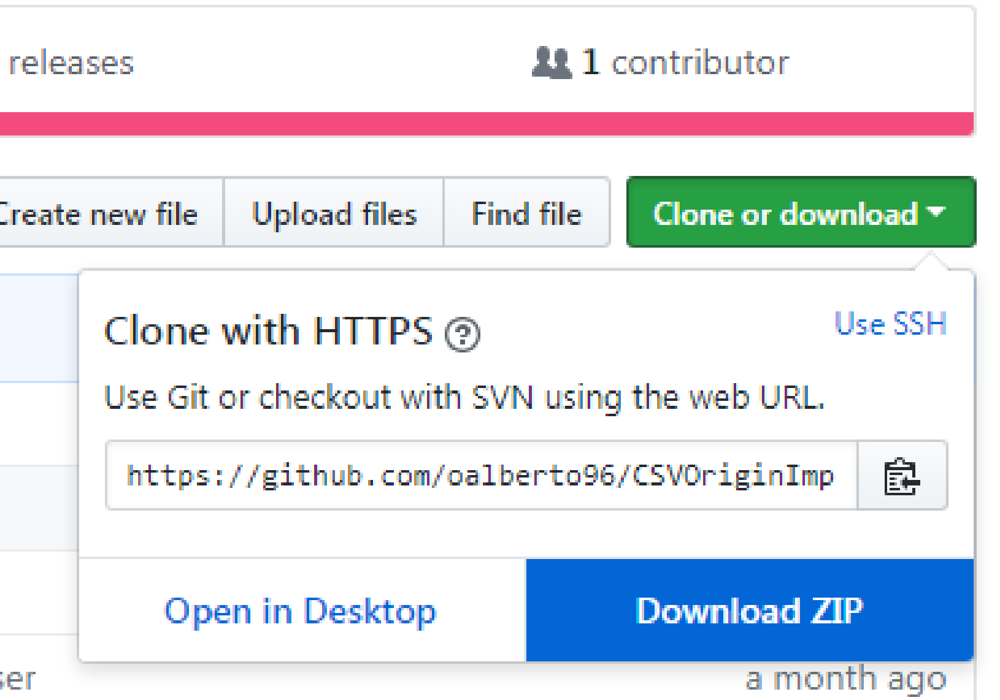
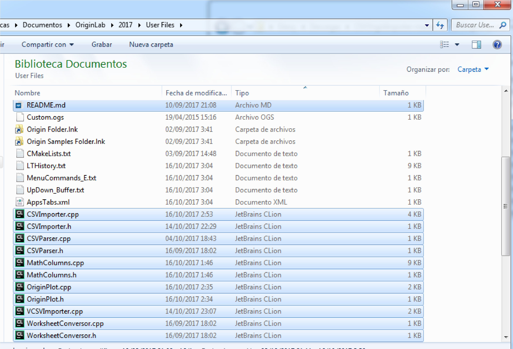
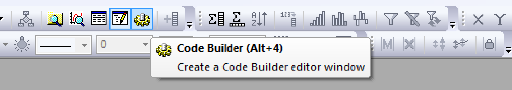
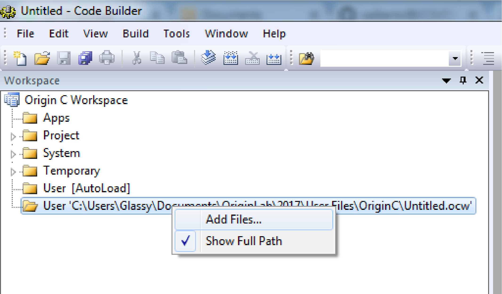
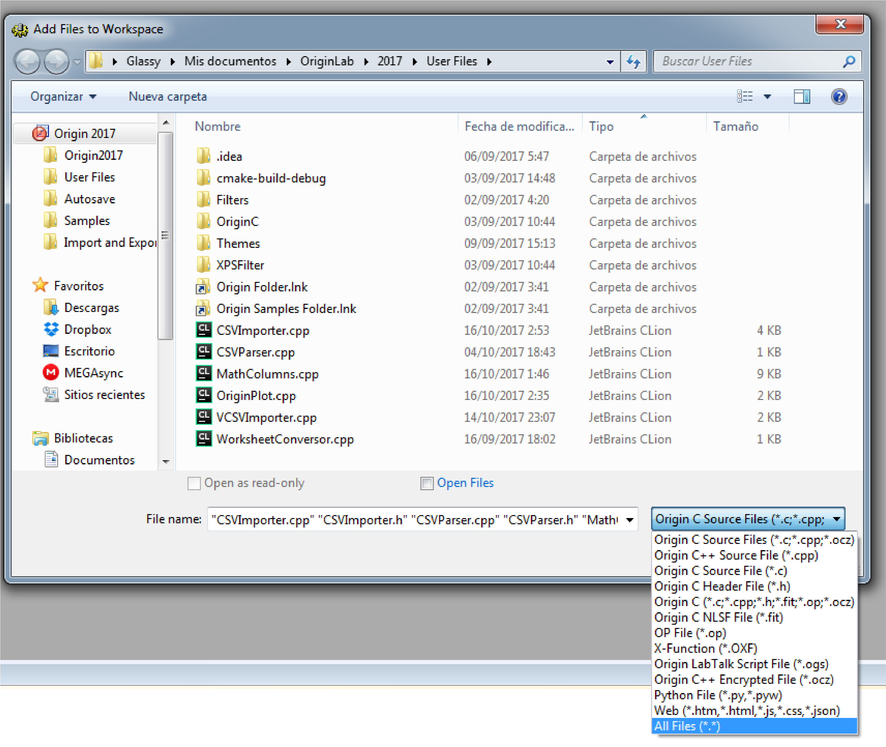
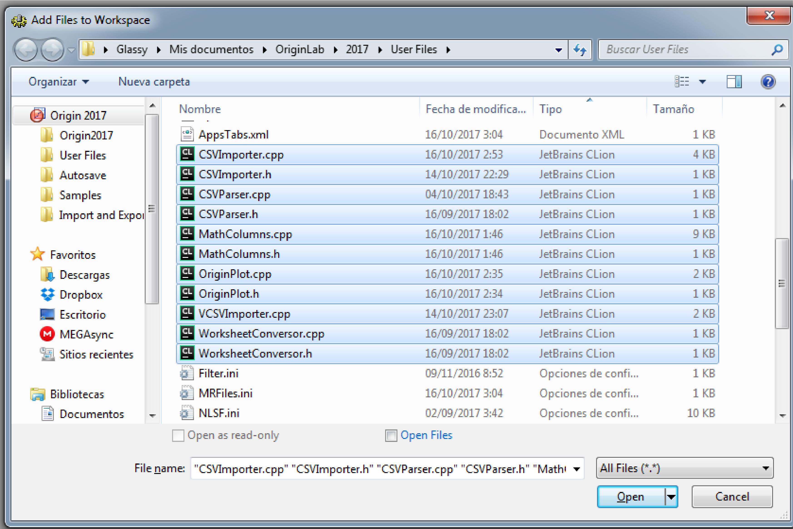
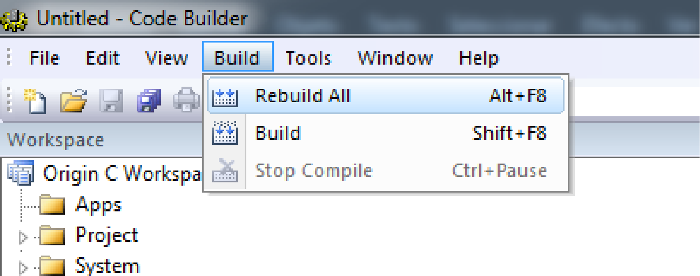
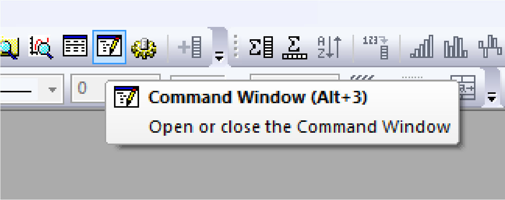

# VCSVOriginImporter
VCSVOriginImporter es un programa que se encarga de importar un archivo csv, y con base a la selección del usuario, tomar una muestra y crear un nuevo espacio de trabajo aplicando diferentes operaciones a la muestra, graficando los resultados.

## Documentación técnica 

### Requisitos
* Origin 9

### Instalación

1. Dar click en el botón clone y luego en Download ZIP para descargar los archivos

1. Copiar todos los archivos dentro de la carpeta que CSVOriginImporter que se descargo anteriormente y a la ruta `C:\Users\nombreUsuario\Documents\OriginLab\90\User Files` donde `nombreUsuario` es del usuario de la máquina

1. Ingresar a CodeBuilder dentro de Origin

1. Dar click derecho en `C:\Users\nombreUsuario\...Untitled.ocw` y seleccionar Add Files

1. Aparecerá un cuadro de diálogo, dar click en el botón `Origin C sources files`, elegir `All Files` y seleccionar todos los archivos .h y .cpp y dar click en `Open`.
Son 11 archivos en total: 
    1. CSVImporter.cpp
    1. CSVImporter.h
    1. CSVParser.cpp
    1. CSVParser.h
    1. MathColumns.cpp
    1. MathColumns.h
    1. OriginPlot.cpp
    1. OriginPlot.h
    1. VCSVImporter.cpp
    1. WorksheetConversor.cpp
    1. WorksheetConversor.h

1. Dar click en la pestana `Build` y seleccionar `Rebuild All`

1. Dentro de Origin dar click en el boton `Command Window`

1. Escribir en la consola el comando `run VCSVImporter.cpp`

### Autores

Alberto Ochoa - [Oalberto96](https://github.com/oalberto96)

