# CSVOriginImporter

## Instalación

1. Extraer los archivos del proyecto
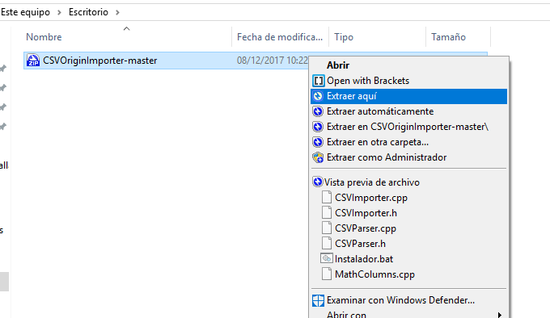

1. Entrar a la carpeta extraida, dar click derecho en el archivo **Instalador.bat** y hacer click en Ejecutar como administrador
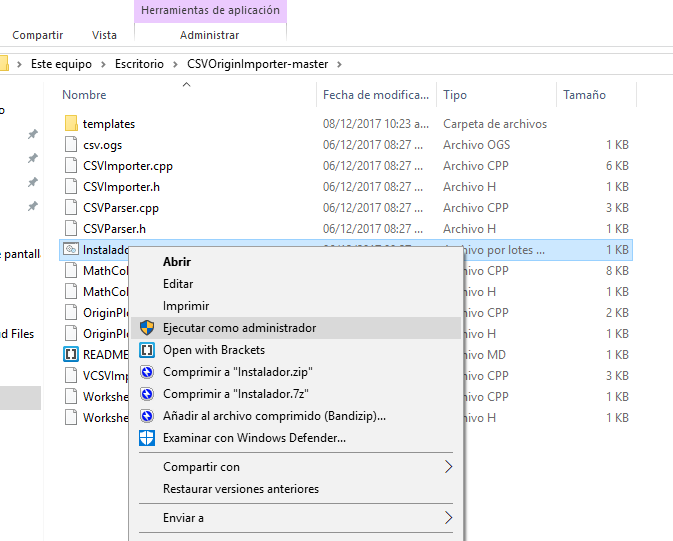

1. Se abrirá una ventana negra, presionar cualquier tecla para continuar.
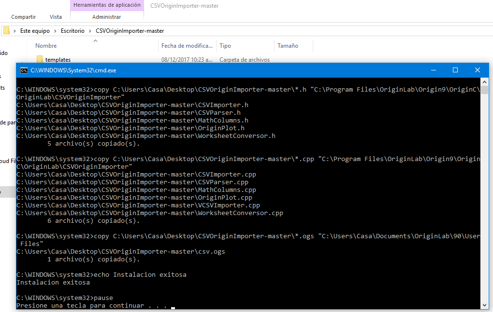

1. Dentro de Origin, dar click en la opción **View > Toolbars**
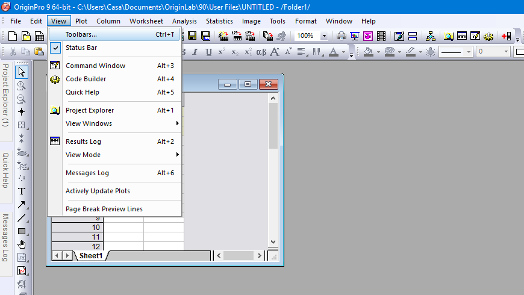

1. Se abrirá una ventana **Customize**, dar click en la pestana Button Groups
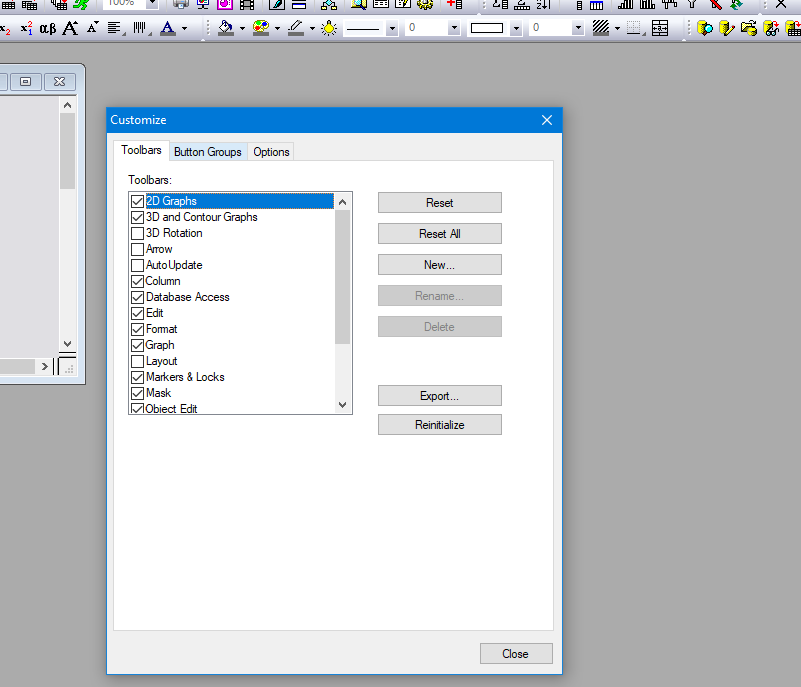

1. En la pestaña Button Groups, dentro del listado buscar la opcion **User Defined**
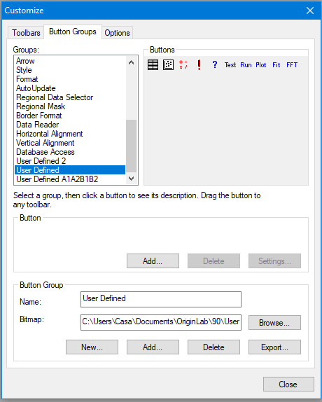

1. Seleccionar cualquier botón
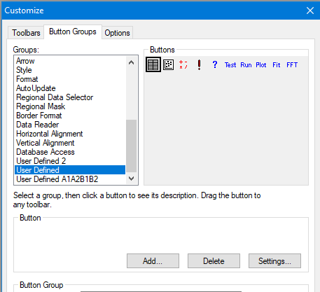

1. Dar click en **Settings...**
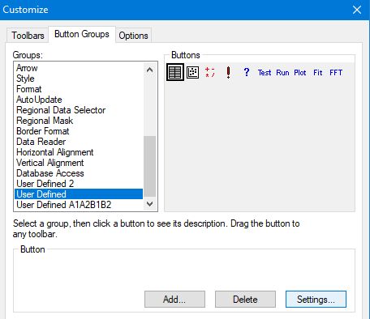

1. Se abrirá una ventana **Button Settings**, dar click en **Browse...**
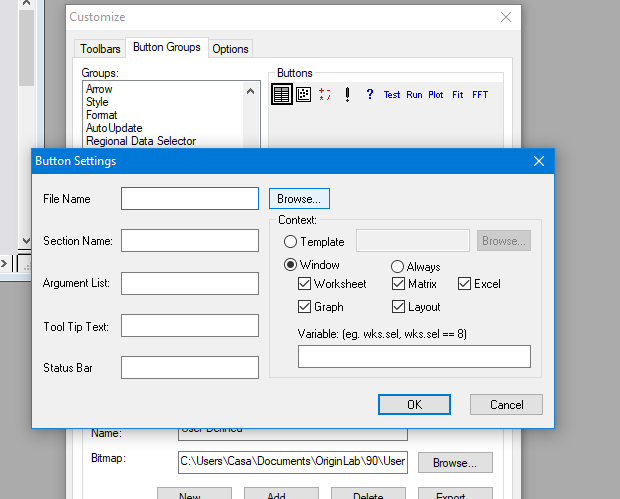

1. Seleccionar el archivo **csv.ogs** que se encuentra en la ruta **Documents\OriginLab\90\User Files\**
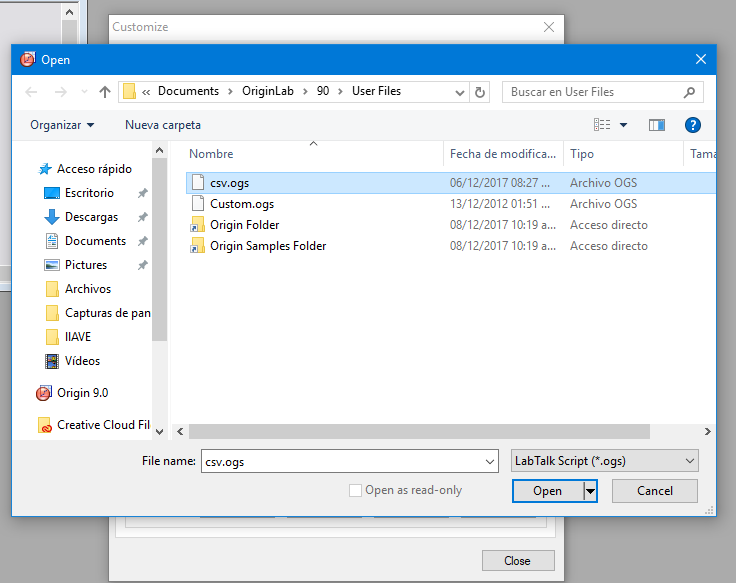

1. Dar click en **Ok**
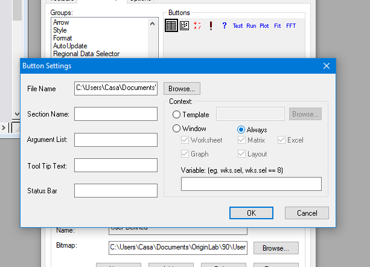

1. Arrastrar el botón seleccionador fuera de la ventana **Customize** y cerrar la ventana.
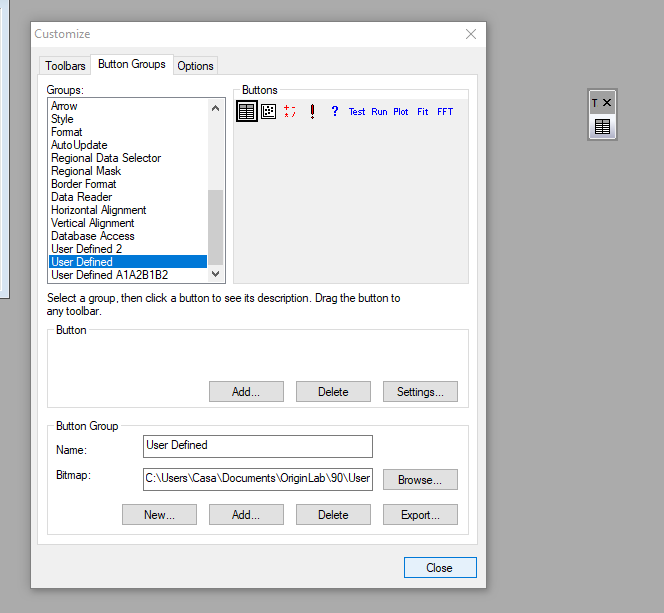

1. Dar doble click al nuevo boton
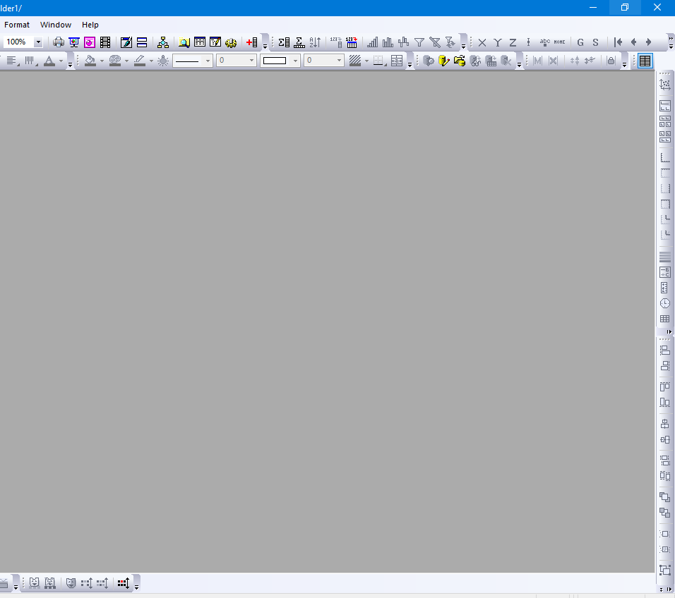
