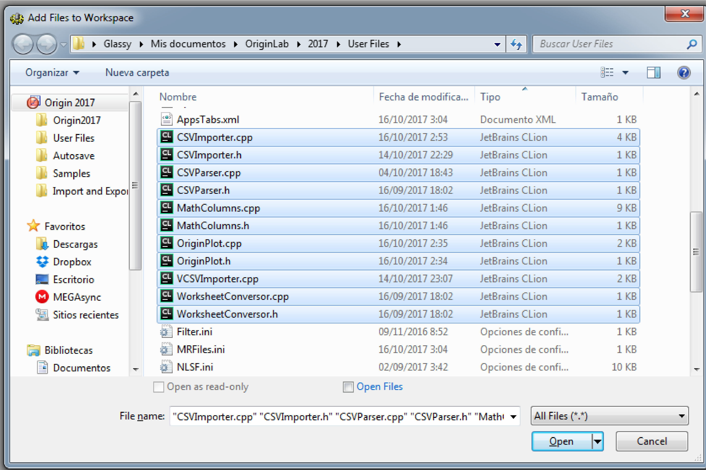

# Documentacion tecnica
# VCSVOriginImporter

CSVOriginImporter es un programa que se encarga de importar un archivo csv (*Figura 1*),
y con base a la seleccion del usuario, tomar una muestra y crear un nuevo espacio de trabajo aplicando diferentes operaciones a la muestra, graficando los resultados.  (*Figura 2*).


*Figura 1*


*Figura 2*

### Requisitos
* Origin 9

### Instalacion

1. Dar click en el boton clone para descargar los arhivos


1. Copiar todos los arhivos dentro de la carpeta que CSVOriginImporter que se descargo anteriormente y a la ruta `C:\Users\nombreUsuario\Documents\OriginLab\90\User Files` donde `nombreUsuario` es del usario de la maquina


1. Ingresar a CodeBuilder dentro de Origin


1. Dar click derecho en `C:\Users\nombreUsuario\...Untitled.ocw` y seleccionar Add Files


1. Aparecera un cuadro de dialogo, dar click en el boton `Origin C sources files`, elegir `All Files` y seleccionar todos los arhivos .h y .cpp y dar click en `Open`.
Son 11 archivos en total: 
    1. CSVImporter.cpp
    1. CSVImporter.h
    1. CSVParser.cpp
    1. CSVParser.h
    1. MathColumns.cpp
    1. MathColumns.h
    1. OriginPlot.cpp
    1. OriginPlot.h
    1. VCSVImporter.cpp
    1. WorksheetConversor.cpp
    1. WorksheetConversor.h



1. Dar click en la pestana `Build` y seleccionar `Rebuild All`


1. Dentro de Origin dar click en el boton `Command Window`


# Clases


## CSVImporter
**Descripcion:**
Esta clase se encarga de invocar los demas metodos
**Funciones:**


## CSVParser
**Descripcion:**
Su funcion principal es darle formato al archivo CSV para poder importarlo como archivo ASCII

**Funciones:**
```c
string createCopy(string str_path);
```
Crea una copia temporal del archivo CSV para poder modificiarlo

```c
string loadTextFile(string str_path);
```
Carga el archivo de texto temporal

```c
string replaceComas(string str_path_temp);
```
Cambia las comas por espacios para darle el formato necesario para importarlo

## MathColumns
**Descripcion:**
Esta clase se encarga de realizar asignar las operaciones matematicas en columnas y ejecutarlas

**Funciones:**
```c
columnDivide(Column result_col);
```
Divide cada dato de la columna entre el primer numero
```c
columnLn(Column col);
```
Calcula el logaritmo natural de la columna asignada

## WorksheetConversor
**Descripcion:**
Se encarga de la manipulacion de *Worksheets* 

**Funciones:**
```c
void RowtoColumn(Worksheet* wks,Column col,int rowIndex);
```
Recibe una hoja de trabajo y regresa como columna el renglon asignado por `rowIndex`

```c
void generateTimeColumn(Column col);
```
Genera una columna de tiempo para el eje X
